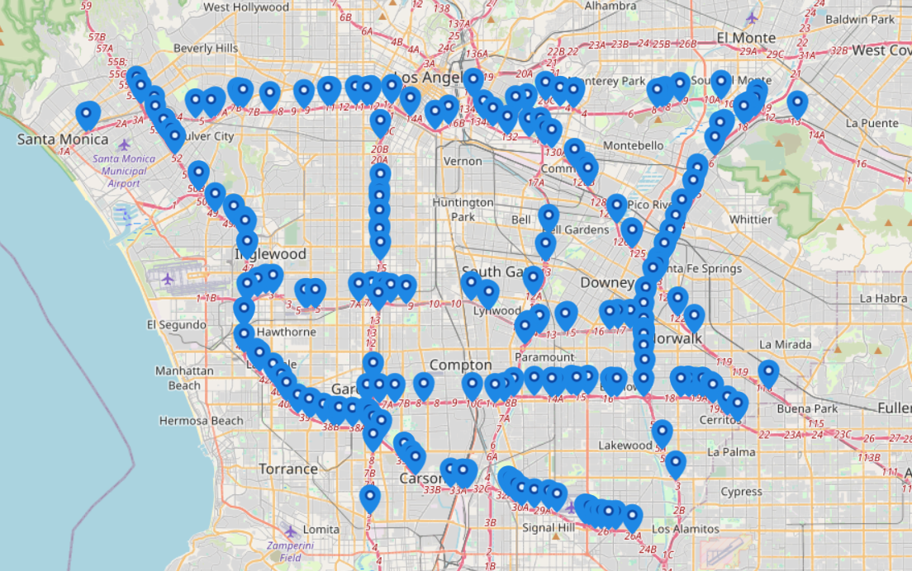
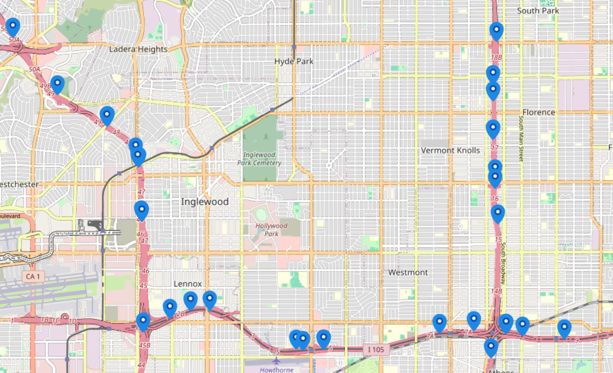
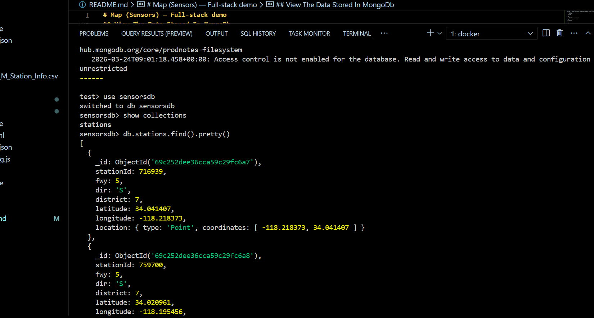

# Map (Sensors) — Full‑stack demo

This repository contains:
- **Frontend**: React + Vite + Leaflet (`frontend/`) served on **:5173**
- **Backend**: Node.js + Express + MongoDB (`backend/`) served on **:5000**
- **MongoDB**: initialization script + indexes (`mongo/`)
- **Dataset**: station metadata CSV (`data/PeMSD7_M_Station_Info.csv`)


## Screen Shots from the project

[](docs/images/image1.png)
[](docs/images/image2.png)


## Project structure

- `frontend/`: Vite app (React, Leaflet)
- `backend/`: Express API that loads the CSV into MongoDB and serves:
  - `GET /api/stations`
  - `GET /api/links`
  - `GET /api/health`
- `mongo/`: Mongo image + `init.js` creating DB/indexes
- `data/`: CSV file imported by the backend at startup

## Prerequisites

- **Node.js 20+** and npm (for local dev), or **Docker** (for containers)

## Local development (no Docker)

### 1) Start MongoDB (recommended: Docker volume, no local install)

You don’t need to install MongoDB on your machine. Run it in Docker with a **named volume** (data persists across container restarts):

PowerShell:

```bash
docker volume create sensors-mongo-data
docker run -d --name mongo -p 27017:27017 `
  -v sensors-mongo-data:/data/db `
  -v "${PWD}\mongo\init.js:/docker-entrypoint-initdb.d/init.js:ro" `
  -e MONGO_INITDB_DATABASE=sensorsdb `
  mongo:7
```

PowerShell (one line):

```bash
docker run -d --name mongo -p 27017:27017 -v sensors-mongo-data:/data/db -v "${PWD}\mongo\init.js:/docker-entrypoint-initdb.d/init.js:ro" -e MONGO_INITDB_DATABASE=sensorsdb mongo:7
```

Bash (Git Bash / WSL / Linux / macOS):

```bash
docker volume create sensors-mongo-data
docker run -d --name mongo -p 27017:27017 \
  -v sensors-mongo-data:/data/db \
  -v "$(pwd)/mongo/init.js:/docker-entrypoint-initdb.d/init.js:ro" \
  -e MONGO_INITDB_DATABASE=sensorsdb \
  mongo:7
```

### 2) Start the backend

```bash
cd backend
npm install
$env:MONGO_URI="mongodb://localhost:27017"
npm start
```

Notes:
- Backend listens on `http://localhost:5000`
- Backend imports `data/PeMSD7_M_Station_Info.csv` into DB `sensorsdb` at startup.

### 3) Start the frontend

```bash
cd frontend
npm install
npm run dev
```

Frontend listens on `http://localhost:5173`.

## Docker (build + run)

This repo includes separate Dockerfiles for each service. If you are not using `docker compose`, you can run them manually on a shared network.

Tip: for MongoDB persistence, use a named volume (example below).

### 1) Network + Mongo

```bash
docker network create sensors-net
docker volume create sensors-mongo-data
docker run -d --name mongo --network sensors-net -p 27017:27017 `
  -v sensors-mongo-data:/data/db `
  -v "${PWD}\mongo\init.js:/docker-entrypoint-initdb.d/init.js:ro" `
  -e MONGO_INITDB_DATABASE=sensorsdb `
  mongo:7
```

### 2) Backend

```bash
docker build -t sensors-backend -f backend/Dockerfile .
docker run -d --name sensors-backend --network sensors-net -p 5000:5000 -e MONGO_URI="mongodb://mongo:27017" sensors-backend
```

### 3) Frontend

```bash
docker build -t sensors-frontend ./frontend
docker run -d --name sensors-frontend --network sensors-net -p 5173:5173 sensors-frontend
```

## Configuration

- **Backend**
  - `MONGO_URI` (optional): defaults to `mongodb://mongo:27017`
  - Port: fixed to `5000`

## Troubleshooting

- **Mongo connection fails**: ensure `MONGO_URI` points to the right host (`localhost` for local, `mongo` for Docker network).
- **Ports already in use**: stop the process using `5173`, `5000`, or `27017`, or remap ports with `-p HOST:CONTAINER`.


## View The Data Stored In MongoDb


- In order to see the data that are stored in your database, you have to execute this commands

1. Docker Ps:
   ```powershell
   docker ps
   ```

2. Then:
   ```powershell
   docker exec -it mongodb mongosh

3. Then:
  ```powershell
  use sensorsdb
  ```

4. Then: 
  ```powershell
  show collections
  ```

5. Then: 
  ```powershell
  db.stations.find().pretty()`
  ```


  [](docs/images/image3.png)